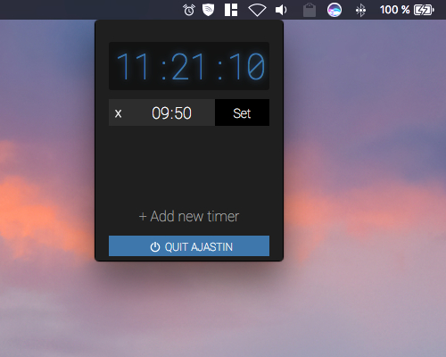

# Ajastin
(f. finish = 'timer' or 'alarm clock')

A simple alarm clock, made with REACT.
This is my first real REACT project I created in cooperation with [Robin Wieruch](https://github.com/rwieruch). All code is documented inline.

This is meant to be a guideline or a little help for beginners. This little piece of software is not perfect and could be improved in so many ways, but it shows some basic things when you wanna start with REACT. I wanna share my experiences when I started with REACT. Nothing more, but nothing less.

Fork it, share it, improved it, enjoy it. Feedback appreciated.

# Requirements
I used the [npm module uuid](https://www.npmjs.com/package/uuid) to generate unique IDs for every alarm clock.

# Usage
Because of I started this project by using ['Create-React-App'](https://github.com/facebook/create-react-app) you can do this too.
If you are using 'Create-React-App' just put all the files from here into the 'src/' folder.

# Credits
The audio file 'Ringtone-for-alarm' was made by [ALEXANDER](http://www.orangefreesounds.com/ringtone-for-alarm/). It is released under the [Attribution-NonCommercial 4.0 International (CC BY-NC 4.0)](https://creativecommons.org/licenses/by-nc/4.0/) license.

The font [Roboto](https://fonts.google.com/specimen/Roboto) and [Roboto-Mono](https://fonts.google.com/specimen/Roboto+Mono) are created by Christian Robertson and are released under the [Apache License, Version 2.0](http://www.apache.org/licenses/LICENSE-2.0).

Many thanks to [Robin](https://github.com/rwieruch) for the support and the angel-like patience. ;)

# Extension

As I want to use this small app as a menubar integration for my Mac, I put it all into an Electron app environment and used the [menubar](https://github.com/maxogden/menubar) extension to create a menubar desktop application with Electron. To document this here would go beyond the scope and would possibly distract from the basic goal. It was a little bit tricky to match all my needs, but I'm sure you will figure it out, if you wanna do something similar.

I put an "ready-to-use" example in the **app/** folder.
